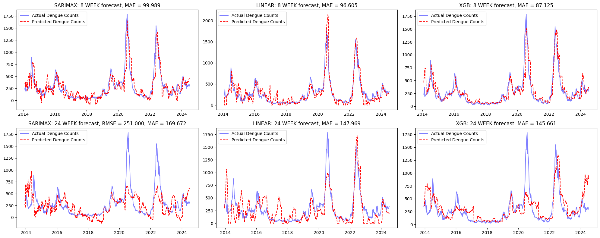
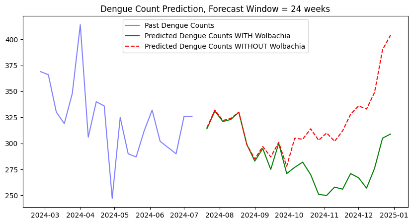
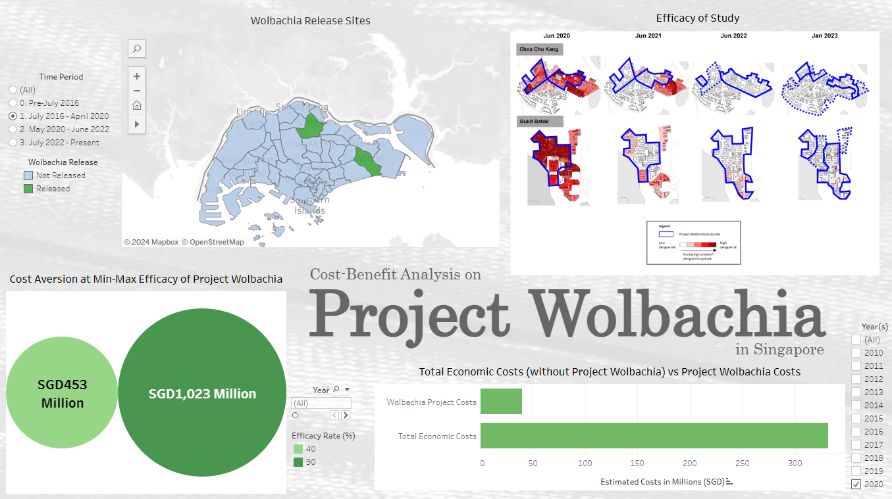

# :mosquito: Dengue in Singapore :mosquito:
##### Predicting future Dengue cases & a cost-benefit analysis of Project Wolbachia

# Table of Contents

1. [Problem Statement](#problem-statement)
2. [Scope](#scope)
3. [Methodology](#methodology)
4. [Data Dictionary](#data-dictionary)
5. [Summary of Findings](#summary-of-findings)
6. [Installation](#installation)
    - [Datasets](#datasets)
    - [Dependencies](#dependencies)
    - [.ipynb](#ipynb)
7. [Annexes](#annexes)
    - [Datasets](#datasets-1)
    - [References and Citations](#references-and-citations)
    
## Problem Statement

Singapore, with its tropical climate and urban landscape, has long been susceptible to outbreaks of dengue fever. In an effort to combat this public health challenge, we introduce an advanced prediction model designed to forecast dengue cases in Singapore. Leveraging historical data on weekly dengue cases, as well as key environmental factors such as temperature and humidity, our model employs cutting-edge machine learning techniques to provide accurate and timely predictions. By anticipating potential outbreaks up to eight weeks in advance, this model aims to empower healthcare authorities and policymakers with the insights needed to implement proactive measures, thereby reducing the impact of dengue fever on the community.

## Scope
This project aims to analyze the trends of several features from historical data to forecast possible dengue cases in Singapore. There is also a cost-benefit analysis of one of the government's efforts to combat dengue fever, namely Project Wolbachia, to justify whether or not the government should continue with the ongoing project.

## Methodology

The dataset is compiled using data from various sources including scraped data from [weather.gov](http://www.weather.gov.sg/climate-historical-daily/), [data.gov](https://data.gov.sg/), [NEA](https://www.nea.gov.sg/), etc. Additional data is gathered through desk research to quantify Wolbachia efforts by determining the proportion of Singaporean estates where male Wolbachia-Aedes mosquitoes are released. The impact of COVID-19 related restrictions and subsequent increased post-lockdown construction activity, both of which have influenced dengue cases, is also considered. Details of the data-gathering process is provided in the accompanying notebook `dengue_scraper.ipynb` in the `data` subdirectory.

Three predictive models for the dengue forecasting task at hand, namely SARIMAX, linear regression, and XGBoost. The models were built on a dataset gathered for this project, consisting of historical weather information, Google search trends, as well as Wolbachia coverage and external events. Additional efforts are spent to create lagged feature and target values for the second and third models, as data order is not automatically accounted for in these frameworks.

## Data Dictionary
The compiled dataframe used for model training is given by `df_raw`.
| Feature               | Type  | Description                                                             |
|-----------------------|-------|-------------------------------------------------------------------------|
| Year                  | int   | Year                                                                    |
| Week                  | int   | Week                                                                    |
| Dengue_Count          | float | Weekly count of dengue fever incidence                                  |
| Daily_Rainfall        | float | Average daily rainfall of week                                          |
| Mean_Temperature      | float | Mean temperature of week                                                |
| Max_Temperature       | float | Average daily maximum temperature of week                               |
| Min_Temperature       | float | Average daily minimum temperature of week                               |
| Min_Wind_Speed        | float | Average daily minimum wind speed of week                                |
| Max_Wind_Speed        | float | Average daily maximum wind speed of week                                |
| Relative_Humidity     | float | Average relative humidity of week                                       |
| Trend_Dengue          | float | Weekly Google search count for keyword "dengue"                         |
| Trend_Dengue_Symptoms | float | Weekly Google search count for keyword "dengue+symptoms"                |
| Trend_Fever           | float | Weekly Google search count for keyword "fever"                          |
| Trend_Mosquito        | float | Weekly Google search count for keyword "mosquito"                       |
| Wolbachia_Ratio       | float | Proportion of estate where Wolbachia mosquitos are released in the week |
| External_Events       | int   | COVID-19 lockdown in place or heightened construction activity          |

## Summary of Findings
As shown below, the XGBoost model stands out as the best performing model, showing the lowest noise levels and yielding the lowest Mean Absolute Error (MAE).

A refined XGBoost model, accounting for uncertainty in feature inputs, is then used to investigate the effects of the Wolbachia Project, showing clear signs of increased dengue occurences in its absence.

Furthermore, with an annual cost of only SGD40M per year, the cost-benefit analysis done on the Singapore government's Project Wolbachia also shows promising results, potentially saving over SGD1B over 11 years. A dashboard outlining the details of the analysis can be found here:

https://public.tableau.com/app/profile/mohamad.faeliq.ramley/viz/WolbachiaCostBenefit/ProjectWolbachiaSingapore

It is therefore recommended that Project Wolbachia efforts be continued and further strengthened, if possible.

## Installation

***Datasets***

All datasets used are located in the assets folder, within the repository

***Dependencies***

Install the dependencies by opening your terminal in the project folder and run:

`pip install -r requirements.txt`

After installation, you should then be able to run the code smoothly :smile:

***.ipynb***

The project file is in .ipynb format and was created in VS Code and Jupyter Notebook :book:

### Annexes

***Datasets***

*'datagov_dengue.csv'* - https://beta.data.gov.sg/datasets/d_ac1eecf0886ff0bceefbc51556247015/view </n>
Weekly dengue fever cases in Singapore from 2014 - 2018

*'datagov_RH.csv'* - https://beta.data.gov.sg/datasets/d_e3b1111a26b2aefef4f386c068d4ca5d/view </n>
Monthly mean data of relative humidity from 2012 - 2024

*'datagov_weather.csv'* - https://beta.data.gov.sg/datasets/d_03bb2eb67ad645d0188342fa74ad7066/view </n>
Daily weather data including rainfall, temperature and wind speed from 2009 - 2017

'google_trend_dengue.csv' - https://trends.google.com/trends/explore?geo=SG&q=dengue </n>
Weekly counts of 'dengue' Google search term from 2012 - 2024

'google_trend_dengue_symptoms.csv' - https://trends.google.com/trends/explore?geo=SG&q=dengue%20symptoms </n>
Weekly counts of 'dengue symptoms' Google search term from 2012 - 2024

'google_trend_fever.csv' - https://trends.google.com/trends/explore?geo=SG&q=fever </n>
Weekly counts of 'fever' Google search term from 2012 - 2024

'google_trend_mosquito.csv' - https://trends.google.com/trends/explore?geo=SG&q=mosquito </n>
Weekly counts of 'mosquito' Google search term from 2012 - 2024

'jao_dengue.csv' - https://github.com/jaotheboss/Dengue-Prediction </n>
Weekly dengue cases, mean rainfall and mean temperature from 2012 - 2019

'NEA_dengue.csv' - https://www.nea.gov.sg/dengue-zika/dengue/dengue-cases </n>
Weekly dengue cases in Singapore from 2020 - 2024

'NEA_weather.csv' - http://www.weather.gov.sg/climate-historical-daily/ </n>
Daily weather data including rainfall, temperature and wind speed from 2012 - 2024

***References and Citations***

Economic impact of dengue in Singapore from 2010 to 2020 and the cost-effectiveness of Wolbachia interventions
*Soh S, Ho SH, Seah A, Ong J, Dickens BS, et al. (2021) Economic impact of dengue in Singapore from 2010 to 2020 and the cost-effectiveness of Wolbachia interventions. PLOS Global Public Health 1(10): e0000024. </n>https://doi.org/10.1371/journal.pgph.0000024*
